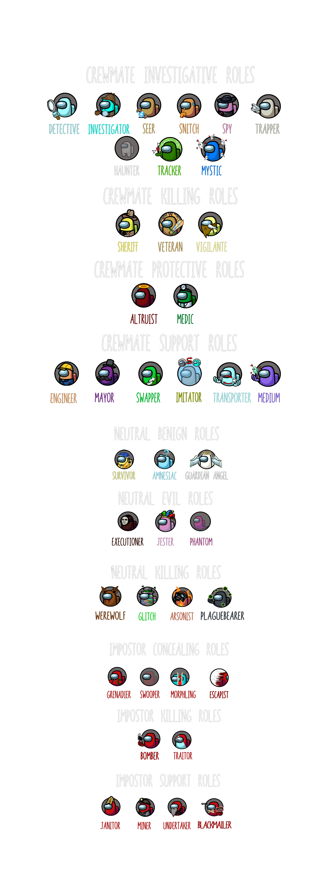

## *Note: This repository is an unofficial continuation of Town of Us due to the original repository being discontinued.*

per chi non capisce l'inglese e capisce l'italiano o per chi preferisce l'italiano ecc... questa è la traduzione dei ruoli in italiano della mod town of us, ricordate non è ufficiale ma una traduzione personale

il discord ufficiale della mod è [Discord](https://discord.gg/ugyc4EVUYZ)

**Crewmate Roles**
- [Detective](#detective)
- [Haunter](#haunter)
- [Investigator](#investigator)
- [Mystic](#mystic)
- [Seer](#seer)
- [Snitch](#snitch)
- [Spy](#spy)
- [Tracker](#tracker)
- [Trapper](#trapper)
- [Sheriff](#sheriff)
- [Veteran](#veteran)
- [Vigilante](#vigilante)
- [Altruist](#altruist)
- [Medic](#medic)
- [Engineer](#engineer)
- [Imitator](#imitator)
- [Mayor](#mayor)
- [Medium](#medium)
- [Swapper](#swapper)
- [Transporter](#transporter)

**Neutral Roles**
- [Amnesiac](#amnesiac)
- [Guardian Angel](#guardian-angel)
- [Survivor](#survivor)
- [Executioner](#executioner)
- [Jester](#jester)
- [Phantom](#phantom)
- [Arsonist](#arsonist)
- [Juggernaut](#juggernaut)
- [Plaguebearer](#plaguebearer)
- [The Glitch](#the-glitch)
- [Werewolf](#werewolf)

**Impostor Roles**
- [Escapist](#escapist)
- [Grenadier](#grenadier)
- [Morphling](#morphling)
- [Swooper](#swooper)
- [Bomber](#bomber)
- [Traitor](#traitor)
- [Blackmailer](#blackmailer)
- [Janitor](#janitor)
- [Miner](#miner)
- [Undertaker](#undertaker)

**Modifiers**
- [Bait](#bait)
- [Blind](#blind)
- [Diseased](#diseased)
- [Multitasker](#multitasker)
- [Torch](#torch)
- [Button Barry](#button-barry)
- [Flash](#flash)
- [Giant](#giant)
- [Radar](#radar)
- [Lovers](#lovers)
- [Sleuth](#sleuth)
- [Tiebreaker](#tiebreaker)
- [Disperser](#disperser)
- [Double Shot](#double-shot)
- [Underdog](#underdog)

-----------------------
# Roles
# Crewmate Roles
## Detective
### **Team: Crewmates**
Il Detective è un Membro dell'Equipaggio che può esaminare altri giocatori per comportamenti sospetti.\
Se il giocatore esaminato dal Detective ha ucciso di recente, il Detective verrà avvisato..
### Role Info
-Il tuo obiettivo ha un'insolita ossessione per i cadaveri (Altruista/Amnesico/Janitor/Medium/Impresario di pompe funebri)
-Il tuo obiettivo cerca di proteggere se stesso o gli altri con ogni mezzo necessario (Grenadier/Angelo Custode/Medico/Sopravvissuto/Veterano)
-Il tuo obiettivo è un creatore di caos (Bomber/Esecutore/Jester/Scambiatore/Trasportatore)
-Il tuo obiettivo sta nascondendo informazioni (Maestro del Ricatto/Sindaco/Spione/Spalleggiatore/Trapper)
-Il tuo obiettivo è inizialmente innocente ma ha acquisito la capacità di uccidere (Juggernaut/Sceriffo/Traitor/Vigilante/Uomo Lupo)
-Il tuo obiettivo ama interagire con gli altri (Piromane/Detective/Portatore della Peste/Veggente/Tracker)
-Il tuo obiettivo ama esplorare (Ingegnere/Fuggiasco/Investigatore/Minatore/Mistico)
-Il tuo obiettivo vede il mondo attraverso una lente diversa (Glitch/Imitatore/Morphling/Spia)
-Il tuo obiettivo sembra non avere un ruolo specifico (Membro dell'Equipaggio/Impostore)

### Opzioni di Gioco
| Nome | Descrizione | Tipo | Predefinito |
|----------|:-------------:|:------:|:------:|
| Investigatore | La percentuale di probabilità che l'Investigatore appaia | Percentuale | 0% |
| Tempo di Attesa Iniziale Esame | Il tempo di attesa iniziale del pulsante di Esame dell'Investigatore | Tempo | 25s |
| Tempo di Attesa Esame | Il tempo di attesa del pulsante di Esame dell'Investigatore | Tempo | 10s |
| Durata Macchiatura | Quanto a lungo i giocatori rimangono macchiati dopo un omicidio | Tempo | 25s |
| Mostra Rapporti Investigatore | Se l'Investigatore dovrebbe ottenere informazioni quando segnala un corpo | Interruttore | Attivo |
| Tempo in cui i Rapporti Investigatore Avranno il Ruolo | Se un corpo è stato morto per un periodo inferiore a questo, il rapporto dell'Investigatore conterrà il ruolo dell'assassino | Tempo | 15s |
| Tempo in cui i Rapporti Investigatore Avranno la Fazione | Se un corpo è stato morto per un periodo inferiore a questo, il rapporto dell'Investigatore conterrà la fazione dell'assassino | Tempo | 30s |
| Mostra Rapporti Esame | Se l'Investigatore dovrebbe ottenere informazioni sul loro ultimo bersaglio esaminato | Interruttore | Attivo |

-----------------------
## Haunter
### **Team: Crewmates**
Il haunter è un Membro dell'Equipaggio morto che può rivelare gli Impostori se completa tutti i suoi compiti.
Una volta completati tutti i compiti, gli Impostori vengono rivelati agli altri membri dell'equipaggio vivi dopo una riunione.
Tuttavia, se il Possessore viene cliccato, perde la sua capacità di rivelare gli Impostori e diventa nuovamente un normale fantasma.

### Opzioni di Gioco
| Nome | Descrizione | Tipo | Predefinito |
|----------|:-------------:|:------:|:------:|
| Possessore | La percentuale di probabilità che il Possessore appaia | Percentuale | 0% |
| Quando Possessore Può Essere Cliccato | Il numero di compiti rimanenti quando il Possessore può essere cliccato | Numero | 5 |
| Avviso Possessore | Il numero di compiti rimanenti quando gli Impostori vengono avvisati che il Possessore sta per completare i compiti | Numero | 1 |
| Il Possessore Rivela Ruoli Neutrali | Se il Possessore rivela anche i Ruoli Neutrali | Interruttore | Falso |
| Chi può Cliccare il Possessore | Se anche gli altri Membri dell'Equipaggio possono cliccare il Possessore | Tutti / Non Equipaggio / Solo Impostori | Tutti |

-----------------------
## Investigator
### **Squadra: Membri dell'Equipaggio**
L'Investigatore è un Membro dell'Equipaggio che può vedere le impronte dei giocatori.
Ogni impronta scompare dopo un certo periodo di tempo.

### Opzioni di Gioco
| Nome | Descrizione | Tipo | Predefinito |
|----------|:-------------:|:------:|:------:|
| Investigatore | La percentuale di probabilità che l'Investigatore appaia | Percentuale | 0% |
| Dimensione Impronta | La dimensione dell'impronta su una scala da 1 a 10 | Numero | 4 |
| Intervallo Impronta | L'intervallo di tempo tra due impronte | Tempo | 0.1s |
| Durata Impronta | La quantità di tempo per cui l'impronta rimane sul terreno | Tempo | 10s |
| Impronte Anonime | Quando attivate, tutte le impronte sono grigie anziché dei colori dei giocatori | Interruttore | Falso |
| Impronta Ventola Visibile | Se mostrare le impronte vicino alle ventole | Interruttore | Falso |

-----------------------
## Mystic
### **Squadra: Membri dell'Equipaggio**
Il Mistico è un Membro dell'Equipaggio che riceve un avviso quando qualcuno muore.
Inoltre, il Mistico ottiene brevemente una freccia che indica la direzione del corpo.

### Opzioni di Gioco
| Nome | Descrizione | Tipo | Predefinito |
|----------|:-------------:|:------:|:------:|
| Mistico | La percentuale di probabilità che il Mistico appaia | Percentuale | 0% |
| Durata Freccia | La durata delle frecce che indicano i corpi | Tempo | 0.1s |
voglio

-----------------------
## Seer
### **Squadra: Membri dell'Equipaggio**
Il Veggente è un Membro dell'Equipaggio che può rivelare l'alleanza degli altri giocatori.
In base alle impostazioni, il Veggente può scoprire se un giocatore è di ruolo Buono o Cattivo.
Il nome di un giocatore cambierà colore in base al suo team.

### Opzioni di Gioco
| Nome | Descrizione | Tipo | Predefinito |
|----------|:-------------:|:------:|:------:|
| Veggente | La percentuale di probabilità che il Veggente appaia | Percentuale | 0% |
| Tempo di Recupero Veggente | Il tempo di recupero del pulsante Rivelazione del Veggente | Tempo | 25s |
| Uccisioni dei Membri dell'Equipaggio appaiono come Cattive | I ruoli degli Uccisioni dei Membri dell'Equipaggio appaiono in Rosso | Interruttore | Falso |
| Neutrali Benigni appaiono come Cattivi | I ruoli dei Neutrali Benigni appaiono in Rosso | Interruttore | Falso |
| Neutrali Cattivi appaiono come Cattivi | I ruoli dei Neutrali Cattivi appaiono in Rosso | Interruttore | Falso |
| Uccisioni Neutrali appaiono come Cattive | I ruoli delle Uccisioni Neutrali appaiono in Rosso | Interruttore | Falso |
| Il Traditore non cambia colore | Il Traditore mantiene il suo colore originale | Interruttore | Falso |

-----------------------
## Snitch
### **Team: Crewmates**

Lo Spione è un Membro dell'Equipaggio che può ottenere frecce che indicano gli Impostors, una volta completati tutti i loro compiti.\
I nomi degli Impostors appariranno anche in rosso sullo schermo dello Spione.\
Tuttavia, quando lo Spione ha solo un compito rimasto, gli Impostors ottengono una freccia che indica lo Spione.
### Game Options
| Name | Description | Type | Default |
|----------|:-------------:|:------:|:------:|
| Snitch | The percentage probability of the Snitch appearing | Percentage | 0% |
| Snitch Sees Neutral Roles | Whether the Snitch also Reveals Neutral Roles | Toggle | False |
| Tasks Remaining When Revealed | The number of tasks remaining when the Snitch is revealed to Impostors | Number | 1 |
| Snitch Sees Impostors in Meetings | Whether the Snitch sees the Impostor's names red in Meetings | Toggle | True |
| Snitch Sees Traitor | Whether the Snitch sees the Traitor | Toggle | True |

-----------------------
## Spy
### **Team: Crewmates**

The Spy is un Membro dell'Equipaggio che ottiene più informazioni quando si trova sulla Tabella di Amministrazione e sulle Vitals.\
Sulla Tabella di Amministrazione, lo Spy può vedere i colori di ogni persona sulla mappa.\
Sulle Vitals, lo Spy può vedere da quanto tempo i corpi uccisi sono morti.
### Game Options
| Name | Description | Type | Default |
|----------|:-------------:|:------:|:------:|
| Spy | The percentage probability of the Spy appearing | Percentage | 0% |
| Who Sees Dead Bodies On Admin | Which players see dead bodies on the admin map | Nobody / Spy / Everyone But Spy / Everyone | Nobody |

-----------------------
## Tracker
### **Team: Crewmates**
Il Tracciatore è un Membro dell'Equipaggio che può rintracciare gli altri giocatori monitorandoli durante una partita.\
Una volta che hanno individuato qualcuno, una freccia punta continuamente verso di loro, che si aggiorna a intervalli prestabiliti.
### Game Options
| Name | Description | Type | Default |
|----------|:-------------:|:------:|:------:|
| Tracker | The percentage probability of the Tracker appearing | Percentage | 0% |
| Arrow Update Interval | The time it takes for the arrow to update to the new location of the tracked player | Time | 5s |
| Track Cooldown | The cooldown on the Tracker's track button | Time | 25s |
| Tracker Arrows Reset Each Round | Whether Tracker Arrows are removed after each meeting | Toggle | False |
| Maximum Number of Tracks Per Round | The number of new people they can track each round | Number | 3 |

-----------------------
## Trapper
### **Team: Crewmates**

Il Trapper è un Membro dell'Equipaggio che può posizionare trappole sulla mappa.\
Quando i giocatori entrano in una trappola, attivano la trappola.\
Nella successiva riunione, tutti i giocatori che hanno attivato una trappola avranno il loro ruolo mostrato al trapper.\
Tuttavia, ciò viene fatto in ordine casuale, senza indicare chi è entrato nella trappola né quale ruolo ha un giocatore specifico.
### Game Options
| Name | Description | Type | Default |
|----------|:-------------:|:------:|:------:|
| Trapper | The percentage probability of the Trapper appearing | Percentage | 0% |
| Min Amount of Time in Trap to Register | How long a player must stay in the trap for it to trigger | Time | 1s |
| Trap Cooldown | The cooldown on the Trapper's trap button | Time | 25s |
| Traps Removed Each Round | Whether the Trapper's traps are removed after each meeting | Toggle | True |
| Maximum Number of Traps Per Game | The number of traps they can place in a game | Number | 5 |
| Trap Size | The size of each trap | Factor | 0.25x |
| Minimum Number of Roles required to Trigger Trap | The number of players that must enter the trap for it to be triggered | Number | 3 |

-----------------------
## Sheriff
### **Team: Crewmates**
Lo Sceriffo è un Membro dell'Equipaggio che ha la capacità di eliminare gli Impostor utilizzando il suo pulsante di uccisione.\
Tuttavia, se uccide un Membro dell'Equipaggio o un giocatore Neutrale che non può uccidere, muore al suo posto.

### Game Options
| Name | Description | Type | Default |
|----------|:-------------:|:------:|:------:|
| Sheriff | The percentage probability of the Sheriff appearing | Percentage | 0% |
| Sheriff Miskill Kills Crewmate | Whether the other player is killed if the Sheriff Misfires | Toggle | False |
| Sheriff Kills Jester | Whether the Sheriff is able to kill the Jester | Toggle | False |
| Sheriff Kills The Glitch | Whether the Sheriff is able to kill The Glitch | Toggle | False |
| Sheriff Kills Executioner | Whether the Sheriff is able to kill the Executioner | Toggle | False |
| Sheriff Kills Arsonist | Whether the Sheriff is able to kill the Arsonist | Toggle | False |
| Sheriff Kills Werewolf | Whether the Sheriff is able to kill the Werewolf | Toggle | False |
| Sheriff Kills Plaguebearer | Whether the Sheriff is able to kill the Plaguebearer | Toggle | False |
| Sheriff Kill Cooldown | The cooldown on the Sheriff's kill button | Time | 25s |
| Sheriff can report who they've killed | Whether the Sheriff is able to report their own kills | Toggle | True |

-----------------------
## Veteran
### **Team: Crewmates**

Il Veterano è un Membro dell'Equipaggio che può mettersi in allerta.
Quando il Veterano è in allerta, chiunque, sia membri dell'equipaggio, neutrali o impostor, se interagiscono con il Veterano, muoiono.
### Game Options
| Name | Description | Type | Default |
|----------|:-------------:|:------:|:------:|
| Veteran | The percentage probability of the Veteran appearing | Percentage | 0% |
| Can Be Killed On Alert | Whether the Veteran dies when someone tries to kill them when they're on alert | Toggle | False |
| Alert Cooldown | The cooldown on the Veteran's alert button. | Time | 5s |
| Alert Duration | The duration of the alert | Time | 25s |
| Maximum Number of Alerts | The number of times the Veteran can alert throughout the game | Number | 3 |

-----------------------
## Vigilante
### **Team: Crewmates**

Il Vigilante è un Membro dell'Equipaggio che può uccidere durante le riunioni.\
Durante le riunioni, il Vigilante può scegliere di uccidere qualcuno indovinando il loro ruolo, tuttavia, se indovinano in modo errato, muoiono al loro posto.
### Game Options
| Name | Description | Type | Default |
|----------|:-------------:|:------:|:------:|
| Vigilante | The percentage probability of the Vigilante appearing | Percentage | 0% |
| Vigilante Kill | The number of kill the Vigilante can do with his ability | Number | 1 |
| Vigilante Multiple Kill  | Whether the Vigilante can kill more than once per meeting | Toggle | False |
| Vigilante Guess Neutral Benign  | Whether the Vigilante can Guess Neutral Benign roles | Toggle | False |
| Vigilante Guess Neutral Evil  | Whether the Vigilante can Guess Neutral Evil roles | Toggle | False |
| Vigilante Guess Neutral Killing  | Whether the Vigilante can Guess Neutral Killing roles | Toggle | False |
| Vigilante Guess Lovers  | Whether the Vigilante can Guess Lovers | Toggle | False |
| Vigilante Guess After Voting  | Whether the Vigilante can Guess after they have voted | Toggle | False |

-----------------------
## Altruist
### **Team: Crewmates**
L'Altruista è un Membro dell'Equipaggio in grado di riportare in vita i giocatori morti.\
Una volta trovato un corpo senza vita, l'Altruista può premere il pulsante di resurrezione, rischiando di sacrificarsi per riportare in vita un altro giocatore.\
Se abilitato, il corpo senza vita scompare, quindi rimane solo il corpo dell'Altruista sulla scena.\
Dopo un determinato periodo di tempo, il giocatore sarà risuscitato, se la resurrezione non viene interrotta.
### Game Options
| Name | Description | Type | Default |
|----------|:-------------:|:------:|:------:|
| Altruist | The percentage probability of the Altruist appearing | Percentage | 0% |
| Altruist Revive Duration | The time it takes for the Altruist to revive a dead body | Time | 10s |
| Target's body disappears on beginning of revive | Whether the dead body of the player the Altruist is reviving disappears upon revival | Toggle | False |

-----------------------
## Medic
### **Team: Crewmates**
Il Medico è un Membro dell'Equipaggio che può dare a qualsiasi giocatore uno scudo che li renderà immortali fino a quando il Medico muore.\
Un giocatore con lo scudo non può essere Trasformato, Hackerato o Ucciso da nessuno, a meno che non si suicidi.\
Se il Medico segnala un corpo senza vita, può ottenere una segnalazione contenente indizi sull'identità dell'Assassino.\
Una segnalazione può contenere il nome dell'assassino o il tipo di colore (più scuro/più chiaro).
### Colors
- Red - Darker
- Blue - Darker
- Green - Darker
- Pink - Lighter
- Orange - Lighter
- Yellow - Lighter
- Black - Darker
- White - Lighter
- Purple - Darker
- Brown - Darker
- Cyan - Lighter
- Lime - Lighter
- Maroon - Darker
- Rose - Lighter
- Banana - Lighter
- Gray - Darker
- Tan - Darker
- Coral - Lighter
- Watermelon - Darker
- Chocolate - Darker
- Sky Blue - Lighter
- Beige - Lighter
- Magenta - Darker
- Turquoise - Lighter
- Lilac - Lighter
- Olive - Darker
- Azure - Lighter
- Plum - Darker
- Jungle - Darker
- Mint - Lighter
- Chartreuse - Lighter
- Macau - Darker
- Tawny - Darker
- Gold - Lighter
- Rainbow - Lighter

### Game Options
| Name | Description | Type | Default |
|----------|:-------------:|:------:|:------:|
| Medic | The percentage probability of the Medic appearing | Percentage | 0% |
| Show Shielded Player | Who should be able to see who is Shielded | Self / Medic / Self + Medic / Everyone | Self |
| Show Medic Reports | Whether the Medic should get information when reporting a body | Toggle | True |
| Time Where Medic Reports Will Have Name | If a body has been dead for shorter than this amount, the Medic's report will contain the killer's name | Time | 0s |
| Time Where Medic Reports Will Have Color Type | If a body has been dead for shorter than this amount, the Medic's report will have the type of color | Time | 15s |
| Who gets murder attempt indicator | Who will receive an indicator when someone tries to Kill them | Medic / Shielded / Everyone / Nobody | Medic |
| Shield breaks on murder attempt | Whether the Shield breaks when someone attempts to Kill them | Toggle | False |

-----------------------
## Engineer
### **Team: Crewmates**
L'Ingegnere è un Membro dell'Equipaggio che può riparare i sabotaggi da qualsiasi punto della mappa.\
Possono utilizzare i condotti di ventilazione per spostarsi facilmente sulla mappa.

### Game Options
| Name | Description | Type | Default |
|----------|:-------------:|:------:|:------:|
| Engineer | The percentage probability of the Engineer appearing | Percentage | 0% |
| Maximum Fixes | The number of times the Engineer can fix a sabotage | Number | 5 |

-----------------------
## Imitator
### **Team: Crewmates**
L'Imitatore è un Membro dell'Equipaggio che può imitare i membri dell'equipaggio deceduti.\
Durante le riunioni, l'Imitatore può selezionare chi imiterà nella successiva partita tra i giocatori deceduti.\
Possono scegliere di utilizzare ogni giocatore deceduto quante volte desiderano.\
È importante notare che l'Imitatore non può imitare tutti i ruoli dell'equipaggio.

### Game Options
| Name | Description | Type | Default |
|----------|:-------------:|:------:|:------:|
| Imitator | The percentage probability of the Imitator appearing | Percentage | 0% |

-----------------------
## Mayor
### **Team: Crewmates**
Il Sindaco è un Membro dell'Equipaggio che può votare più volte.\
Il Sindaco ha una Riserva di Voti, che rappresenta il numero di volte che può votare.\
Hanno l'opzione di astenersi dal voto durante una riunione, aggiungendo quel voto alla Riserva di Voti.\
Finché non tutti hanno votato, il Sindaco può utilizzare quanti voti desidera dalla sua Riserva di Voti.anzi 

### Game Options
| Name | Description | Type | Default |
|----------|:-------------:|:------:|:------:|
| Mayor | The percentage probability of the Mayor appearing | Percentage | 0% |
| Initial Mayor Vote Bank | The number of votes in the Vote Bank at the start of a game | Number | 1 |
| Mayor Votes Show Anonymous | Whether the Mayor's extra votes will show up anonymously | Toggle | False |

-----------------------
## Medium
### **Team: Crewmates**
Il Medium è un Membro dell'Equipaggio che può vedere i fantasmi.\
Durante ogni partita, il Medium ha la capacità chiamata Mediazione.\
Se il Medium utilizza questa abilità e nessuno è morto, non accadrà nulla.\
Tuttavia, se qualcuno è morto, il Medium e il giocatore deceduto saranno in grado di vedersi e comunicare da oltre la tomba!

### Game Options
| Name | Description | Type | Default |
|----------|:-------------:|:------:|:------:|
| Medium | The percentage probability of the Medium appearing | Percentage | 0% |
| Mediate Cooldown | The cooldown of the Medium's Mediate button | Time | 10s |
| Reveal Appearance of Mediate Target | Whether the Ghosts will show as themselves, or camouflaged | Toggle | True |
| Reveal the Medium to the Mediate Target | Whether the ghosts can see that the Medium is the Medium | Toggle | True |
| Who is Revealed | Which players are revealed to the Medium | Oldest Dead / Newest Dead / All Dead | Oldest Dead |

-----------------------
## Swapper
### **Team: Crewmates**
Lo Scambiatore è un Membro dell'Equipaggio che può scambiare i voti di 2 giocatori durante una riunione.\
Tutti i voti per il primo giocatore saranno invece conteggiati per il secondo giocatore e viceversa.

### Game Options
| Name | Description | Type | Default |
|----------|:-------------:|:------:|:------:|
| Swapper | The percentage probability of the Swapper appearing | Percentage | 0% |
| Swapper Can Button | Whether the Swapper Can Press the Button | Toggle | True |

-----------------------
## Transporter
### **Team: Crewmates**
Il Trasportatore è un Membro dell'Equipaggio che può cambiare le posizioni di due giocatori casuali a suo piacimento.\
I giocatori che sono stati trasportati vengono avvisati con un flash blu sullo schermo.

### Game Options
| Name | Description | Type | Default |
|----------|:-------------:|:------:|:------:|
| Transporter | The percentage probability of the Transporter appearing | Percentage | 0% |
| Transport Cooldown | The cooldown of the Transporter's transport ability | Time | 25s |
| Max Uses | The amount of times the Transport ability can be used | Number | 5 |
| Transporter can use Vitals | Whether the Transporter has the ability to use Vitals | Toggle | False |

-----------------------
# Neutral Roles
## Amnesiac
### **Team: Neutral**
L'Amnesico è un Ruolo Neutrale senza condizione di vittoria.\
Non ha alcun compito ed è essenzialmente senza ruolo.\
Tuttavia, può ricordare un ruolo trovando un giocatore morto.\
Una volta che ricorda il suo ruolo, cerca di vincere con la sua nuova condizione di vittoria.

### Game Options
| Name | Description | Type | Default |
|----------|:-------------:|:------:|:------:|
| Amnesiac | The percentage probability of the Amnesiac appearing | Percentage | 0% |
| Amnesiac Gets Arrows | Whether the Amnesiac has arrows pointing to dead bodies | Toggle | False |
| Arrow Appear Delay | The delay of the arrows appearing after the person died | Time | 5s |

-----------------------
## Guardian Angel
### **Team: Neutral**
Il Guardiano Angelico è un Ruolo Neutrale che si allinea con la fazione del suo bersaglio.\
Il suo compito è proteggere il suo bersaglio a tutti i costi.\
Se il suo bersaglio perde, anche lui perde.

### Game Options
| Name | Description | Type | Default |
|----------|:-------------:|:------:|:------:|
| Guardian Angel | The percentage probability of the Guardian Angel appearing | Percentage | 0% |
| Protect Cooldown | The cooldown of the Guardian Angel's Protect button | Time | 25s |
| Protect Duration | How long The Guardian Angel's Protect lasts | Time | 10s |
| Kill Cooldown Reset on Attack | The attackers kill cooldown after they attacked the protected target | Time | 2.5s |
| Max Uses | The amount of times the Protect ability can be used | Number | 5 |
| Show Protected Player | Who should be able to see who is Protected | Self / GA / Self + GA / Everyone | Self |
| Guardian Angel becomes on Target Dead | Which role the Guardian Angel becomes when their target dies | Crewmate / Amnesiac / Survivor / Jester | Crewmate |
| Target Knows GA Exists | Whether the GA's Target knows they have a GA | Toggle | False |
| GA Knows Targets Role | Whether the GA knows their target's role | Toggle | False |

-----------------------
## Survivor
### **Team: Neutral**
Il Sopravvissuto è un Ruolo Neutrale che può vincere semplicemente sopravvivendo.\
Tuttavia, se gli Amanti o un Ruolo Neutrale Malvagio vincono il gioco, il sopravvissuto perde.

### Game Options
| Name | Description | Type | Default |
|----------|:-------------:|:------:|:------:|
| Survivor | The percentage probability of the Survivor appearing | Percentage | 0% |
| Vest Cooldown | The cooldown of the Survivor's Vest button | Time | 25s |
| Vest Duration | How long The Survivor's Vest lasts | Time | 10s |
| Kill Cooldown Reset on Attack | The attackers kill cooldown after they attacked the veste Survivor | Time | 2.5s |
| Max Uses | The amount of times the Vest ability can be used | Number | 5 |

-----------------------
## Executioner
### **Team: Neutral**

L'Esecutore è un Ruolo Neutrale con una propria condizione di vittoria.\
Il loro obiettivo è far votare fuori un giocatore, specificato all'inizio della partita.\
Se quel giocatore viene votato fuori, loro vincono la partita.
### Game Options
| Name | Description | Type | Default |
|----------|:-------------:|:------:|:------:|
| Executioner | The percentage probability of the Executioner appearing | Percentage | 0% |
| Executioner becomes on Target Dead | Which role the Executioner becomes when their target dies | Crewmate / Amnesiac / Survivor / Jester | Crewmate |
| Executioner Can Button | Whether the Executioner Can Press the Button | Toggle | True |

-----------------------
## Jester
### **Team: Neutral**
Il Giullare è un Ruolo Neutrale con una propria condizione di vittoria.\
Se viene votato fuori durante una riunione, il gioco si conclude e loro vincono.\
Tuttavia, il Giullare non vince se i Crewmates, gli Impostors o un altro Ruolo Neutrale vincono.

### Game Options
| Name | Description | Type | Default |
|----------|:-------------:|:------:|:------:|
| Jester | The percentage probability of the Jester appearing | Percentage | 0% |
| Jester Can Button | Whether the Jester Can Press the Button | Toggle | True |
| Jester Can Vent | Whether the Jester Can Vent | Toggle | False |
| Jester Has Impostor Vision | Whether the Jester Has Impostor Vision | Toggle | False |

-----------------------
## Phantom
### **Team: Neutral**

Il Fantasma è un Ruolo Neutrale con una propria condizione di vittoria.\
Diventano semitrasparenti quando muoiono e devono completare tutti i loro compiti senza essere scoperti.
### Game Options
| Name | Description | Type | Default |
|----------|:-------------:|:------:|:------:|
| Phantom | The percentage probability of the Phantom appearing | Percentage | 0% |
| When Phantom Can Be Clicked | The amount of tasks remaining when the Phantom Can Be Clicked | Number | 5 |

-----------------------
## Arsonist
### **Team: Neutral**

L'Arsonista è un Ruolo Neutrale con una propria condizione di vittoria.\
Hanno due abilità, una è di inzuppare gli altri giocatori di benzina.\
L'altra è di accendere tutti i giocatori inzuppati.\
L'Arsonista deve essere l'ultimo assassino rimasto per vincere la partita.
### Game Options
| Name | Description | Type | Default |
|----------|:-------------:|:------:|:------:|
| Arsonist | The percentage probability of the Arsonist appearing | Percentage | 0% |
| Douse Cooldown | The cooldown of the Arsonist's Douse button | Time | 25s |
| Maximum Alive Players Doused | The maximum amount of players that the Arsonist can have doused | Number | 5 |
| Arsonist Has Impostor Vision | Whether the Arsonist Has Impostor Vision | Toggle | False |
| Ignite Cooldown Removed When Arso Is Last Killer | Whether the Arsonist's Ignite Cooldown is removed when they're the final killer | Toggle | False |

-----------------------
## Juggernaut
### **Team: Neutral**

Il Juggernaut è un Ruolo Neutrale con una propria condizione di vittoria.\
La sua abilità speciale è che il suo tempo di recupero per l'uccisione si riduce ad ogni uccisione.\
Ciò significa che in teoria il Juggernaut può avere un tempo di recupero per l'uccisione di 0 secondi!\
Il Juggernaut è anche un ruolo nascosto, il che significa che comparirà casualmente e non può essere controllato mediante percentuali come gli altri ruoli.
The Juggernaut needs to be the last killer alive to win the game.
### Game Options
| Name | Description | Type | Default |
|----------|:-------------:|:------:|:------:|
| Juggernaut Kill Cooldown | The initial cooldown of the Juggernaut's Kill button | Time | 25s |
| Reduced Kill Cooldown Per Kill | The amount of time removed from the Juggernaut's Kill Cooldown Per Kill | Time | 5s |
| Juggernaut can Vent | Whether the Juggernaut can Vent | Toggle | False |

-----------------------
## Plaguebearer
### **Team: Neutral**

Il Plaguebearer è un Ruolo Neutrale con una propria condizione di vittoria, nonché la capacità di trasformarsi in un altro ruolo.\
Il Plaguebearer ha una sola abilità, che gli consente di infettare altri giocatori.\
Una volta infettato, il giocatore infetto può a sua volta infettare altri giocatori interagendo con loro.\
Una volta che tutti i giocatori sono infettati, il Plaguebearer diventa Pestilence.\
La Pestilence è una forza invincibile che può essere eliminata solo tramite voto, persino la morte del suo amante non la uccide.\
Il Plaguebearer o Pestilence deve essere l'ultimo assassino rimasto per vincere il gioco.
### Game Options
| Name | Description | Type | Default |
|----------|:-------------:|:------:|:------:|
| Plaguebearer | The percentage probability of the Plaguebearer appearing | Percentage | 0% |
| Infect Cooldown | The cooldown of the Plaguebearer's Infect button | Time | 25s |
| Pestilence Kill Cooldown | The cooldown of the Pestilence's Kill button | Time | 25s |
| Pestilence can Vent | Whether the Pestilence can Vent | Toggle | False |

-----------------------
## The Glitch
### **Team: Neutral**

Il Glitch è un Ruolo Neutrale con una propria condizione di vittoria.\
L'obiettivo del Glitch è uccidere tutti gli altri giocatori e rimanere l'ultimo in piedi.\
Il Glitch può Hackerare i giocatori, impedendo loro di segnalare i cadaveri e completare le missioni.\
L'Hacking impedisce al giocatore hackerato di fare qualsiasi cosa tranne che muoversi sulla mappa.\
Il Glitch può anche Imitare qualcuno, apparendo esattamente come l'altra persona.
### Game Options
| Name | Description | Type | Default |
|----------|:-------------:|:------:|:------:|
| The Glitch | The percentage probability of The Glitch appearing | Percentage | 0% |
| Mimic Cooldown | The cooldown of The Glitch's Mimic button | Time | 25s |
| Mimic Duration | How long The Glitch can Mimic a player | Time | 10s |
| Hack Cooldown | The cooldown of The Glitch's Hack button | Time | 25s |
| Hack Duration | How long The Glitch can Hack a player | Time | 10s |
| Glitch Kill Cooldown | The cooldown of the Glitch's Kill button | Time | 25s |
| Glitch Hack Distance | How far away The Glitch can Hack someone from | Short / Normal / Long | Short |
| Glitch can Vent | Whether the Glitch can Vent | Toggle | False |

-----------------------
## Werewolf
### **Team: Neutral**

Il Licantropo è un Ruolo Neutrale con una propria condizione di vittoria.
Anche se il Licantropo ha un pulsante di uccisione, non può usarlo a meno che non sia in modalità "Rampage".
Una volta che il Licantropo è in modalità Rampage, ottiene la visione degli Impostori e la capacità di uccidere.
Tuttavia, a differenza della maggior parte degli assassini, il Licantropo ha un tempo di recupero molto breve per l'uccisione.
Il Licantropo deve essere l'ultimo assassino rimasto per vincere la partita.
### Game Options
| Name | Description | Type | Default |
|----------|:-------------:|:------:|:------:|
| Werewolf | The percentage probability of the Werewolf appearing | Percentage | 0% |
| Rampage Cooldown | The cooldown of the Werewolf's Rampage button | Time | 25s |
| Rampage Duration | The duration of the Werewolf's Rampage | Time | 25s |
| Rampage Kill Cooldown | The cooldown of the Werewolf's Kill button | Time | 10s |
| Werewolf can Vent when Rampaged | Whether the Werewolf can Vent when Rampaged | Toggle | False |

-----------------------
# Impostor Roles
## Escapist
### **Team: Impostors**

The Escapist è un Impostor che può teletrasportarsi in una posizione diversa.\
Una volta per round, l'Escapist può marcare una posizione a cui può poi fuggire più avanti nel round.

### Game Options
| Name | Description | Type | Default |
|----------|:-------------:|:------:|:------:|
| Escapist | The percentage probability of the Escapist appearing | Percentage | 0% |
| Recall Cooldown | The cooldown of the Escapist's Recall button | Time | 25s |
| Escapist can Vent | Whether the Escapist can Vent | Toggle | False |

-----------------------
## Grenadier
### **Team: Impostors**
Il Grenadier è un Impostor che può lanciare granate fumogene.\
Durante il gioco, il Grenadier ha l'opzione di lanciare una granata fumogena che acceca i crewmate, impedendo loro di vedere.\
Tuttavia, un sabotaggio e una granata fumogena non possono essere attivi contemporaneamente.

### Game Options
| Name | Description | Type | Default |
|----------|:-------------:|:------:|:------:|
| Grenadier | The percentage probability of the Grenadier appearing | Percentage | 0% |
| Flash Grenade Cooldown | The cooldown of the Grenadier's Flash button | Time | 25s |
| Flash Grenade Duration | How long the Flash Grenade lasts for | Time | 10s |
| Flash Radius | How wide the flash radius is | Multiplier | 1x |
| Indicate Flashed Crewmates | Whether the Grenadier can see who has been flashed | Toggle | False |
| Grenadier can Vent | Whether the Grenadier can Vent | Toggle | False |
-----------------------
## Morphling
### **Team: Impostors**

Il Morphling è un Impostor che può trasformarsi in un altro giocatore.\
All'inizio del gioco e dopo ogni riunione, possono scegliere qualcuno da campionare.\
Possono quindi trasformarsi in quella persona in qualsiasi momento per un periodo di tempo limitato.

### Game Options
| Name | Description | Type | Default |
|----------|:-------------:|:------:|:------:|
| Morphling | The percentage probability of the Morphling appearing | Percentage | 0% |
| Morph Cooldown | The cooldown of the Morphling's Morph button | Time | 25s |
| Morph Duration | How long the Morph lasts for | Time | 10s |
| Morphling can Vent | Whether the Morphling can Vent | Toggle | False |

-----------------------
## Swooper
### **Team: Impostors**

Il Swooper è un Impostor che può diventare temporaneamente invisibile.

### Game Options
| Name | Description | Type | Default |
|----------|:-------------:|:------:|:------:|
| Swooper | The percentage probability of the Swooper appearing | Percentage | 0% |
| Swooper Cooldown | The cooldown of the Swooper's Swoop button | Time | 25s |
| Swooper Duration | How long the Swooping lasts for | Time | 10s |
| Swooper can Vent | Whether the Swooper can Vent | Toggle | False |

-----------------------
## Bomber
### **Team: Impostors**

Il Bomber è un Impostor che ha la capacità di piazzare bombe invece di uccidere.\
Dopo che una bomba è stata piazzata, esploderà dopo un determinato periodo di tempo, come impostato.\
Una volta che la bomba esplode, ucciderà tutti i membri dell'equipaggio (e gli Impostor!) all'interno del raggio d'azione.

### Game Options
| Name | Description | Type | Default |
|----------|:-------------:|:------:|:------:|
| Bomber | The percentage probability of the Bomber appearing | Percentage | 0% |
| Detonate Delay | The delay of the detonation after bomb has been planted | Time | 5s |
| Max Kills In Detonation | Maximum number of kills in the detonation | Time | 5s |
| Detonate Radius | How wide the detonate radius is | Multiplier | 0.25x |
| Bomber can Vent | Whether the Bomber can Vent | Toggle | False |

-----------------------
## Traitor
### **Team: Impostors**

Se tutti gli Impostor muoiono prima di un certo punto nel gioco, un membro casuale dell'equipaggio viene selezionato per diventare il Traditore.\
Il Traditore non ha abilità aggiuntive e il suo compito è semplicemente vendicare gli Impostor morti.\
Una volta che questo giocatore diventa il Traditore, la sua alleanza si unisce agli Impostor.

### Game Options
| Name | Description | Type | Default |
|----------|:-------------:|:------:|:------:|
| Traitor | The percentage probability of the Traitor appearing | Percentage | 0% |
| Latest Spawn | The minimum number of people alive when a Traitor can spawn | Number | 5 |
| Traitor Won't Spawn if Neutral Killing are Alive | Whether the Traitor won't spawn if any Neutral Killing roles are alive | Toggle | False |

-----------------------
## Blackmailer
### **Team: Impostors**
Il Ricattatore è un Impostor che può silenziare le persone durante le riunioni.\
Durante ogni round, il Ricattatore può avvicinarsi a qualcuno e ricattarlo.\
Questo impedisce alla persona ricattata di parlare durante la riunione successiva.

### Game Options
| Name | Description | Type | Default |
|----------|:-------------:|:------:|:------:|
| Blackmailer | The percentage probability of the Blackmailer appearing | Percentage | 0% |
| Initial Blackmail Cooldown | The initial cooldown of the Blackmailer's Blackmail button | Time | 10s |

-----------------------
## Janitor
### **Team: Impostors**
Il Custode è un Impostor che può pulire i corpi.\
Sia la loro abilità di Uccidere che quella di Pulire hanno un cooldown condiviso, il che significa che devono scegliere quale delle due utilizzare.

### Game Options
| Name | Description | Type | Default |
|----------|:-------------:|:------:|:------:|
| Janitor | The percentage probability of the Janitor appearing | Percentage | 0% |

-----------------------
## Miner
### **Team: Impostors**

Il Minatore è un Impostor che può creare nuovi passaggi.\
Questi passaggi si collegano solo tra loro, formando una nuova rete di condotti.

### Game Options
| Name | Description | Type | Default |
|----------|:-------------:|:------:|:------:|
| Miner | The percentage probability of the Miner appearing | Percentage | 0% |
| Mine Cooldown | The cooldown of the Miner's Mine button | Time | 25s |

-----------------------
## Undertaker
### **Team: Impostors**
L'Impostor Undertaker può trascinare e spostare i corpi.

### Game Options
| Name | Description | Type | Default |
|----------|:-------------:|:------:|:------:|
| Undertaker | The percentage probability of the Undertaker appearing | Percentage | 0% |
| Undertaker Drag Cooldown | The cooldown of the Undertaker Drag ability | Time | 25s |
| Undertaker Speed While Dragging | How fast the Undertaker moves while dragging a body in comparison to normal | Multiplier | 0.75x |
| Undertaker can Vent | Whether the Undertaker can Vent | Toggle | False |
| Undertaker can Vent while Dragging | Whether the Undertaker can Vent when they are Dragging a Body | Toggle | False |

-----------------------

questo è solo una traduzione in italiano!!!!! il vero creatore del file è quello indicato qui giù, io ho solo tradotto in italiano i ruoli che ha scritto in inglese. non voglio nessuna responsabilità ed questa è una semplice traduzione non ufficiale ma personale privata della mod town of us

-----------------------
# Credits & Resources
[Reactor](https://github.com/NuclearPowered/Reactor) - The framework of the mod\
[BepInEx](https://github.com/BepInEx) - For hooking game functions\
[Among-Us-Sheriff-Mod](https://github.com/Woodi-dev/Among-Us-Sheriff-Mod) - For the Sheriff role.\
[Among-Us-Love-Couple-Mod](https://github.com/Woodi-dev/Among-Us-Love-Couple-Mod) - For the inspiration of Lovers role.\
[ExtraRolesAmongUs](https://github.com/NotHunter101/ExtraRolesAmongUs) - For the Engineer & Medic roles.\
[TooManyRolesMods](https://github.com/Hardel-DW/TooManyRolesMods) - For the Investigator & Time Lord roles.\
[TorchMod](https://github.com/tomozbot/TorchMod) - For the inspiration of the Torch modifier.\
[XtraCube](https://github.com/XtraCube) - For the RainbowMod.\
[PhasmoFireGod](https://twitch.tv/PhasmoFireGod) and [Ophidian](https://www.instagram.com/ixean.studio) - Button Art.\
[TheOtherRoles](https://github.com/Eisbison/TheOtherRoles) - For the inspiration of the Vigilante, Tracker and Spy roles, as well as the Bait modifier.\
[5up](https://www.twitch.tv/5uppp) and the Submarine Team - For the inspiration of the Grenadier role.\
[Guus](https://github.com/OhMyGuus) - For support for the old Among Us versions (v2021.11.9.5 and v2021.12.15).\
[MyDragonBreath](https://github.com/MyDragonBreath) - For Submerged Compatibility, the Trapper role and support for the new Among Us version (v2022.6.21).\
[ItsTheNumberH](https://github.com/itsTheNumberH/Town-Of-H) - For the code used for Blind, Bait, Poisoner and partially for Tracker, as well as other bug fixes.\
[Ruiner](https://github.com/ruiner189/Town-Of-Us-Redux) - For lovers changed into a modifier and Task Tracking.\
[Term](https://www.twitch.tv/termboii) - For creating Transporter, Medium, Blackmailer, Plaguebearer, Sleuth, Multitasker and porting v2.5.0 to the new Among Us version (v2021.12.15).\
[BryBry16](https://github.com/Brybry16/BetterPolus) - For the code used for Better Polus.\
[Alexejhero](https://github.com/SubmergedAmongUs/Submerged) - For the Submerged map.

[Essentials](https://github.com/DorCoMaNdO/Reactor-Essentials) - For created custom game options.\
v1.0.3 uses [Essentials](https://github.com/DorCoMaNdO/Reactor-Essentials) directly.\
v1.1.0 uses a modified version of Essentials that can be found [here](https://github.com/slushiegoose/Reactor-Essentials).\
v1.2.0 has Essentials embedded and can be found [here](https://github.com/slushiegoose/Town-Of-Us/tree/master/source/Patches/CustomOption).

#

This mod is not affiliated with Among Us or Innersloth LLC, and the content contained therein is not endorsed or otherwise sponsored by Innersloth LLC. Portions of the materials contained herein are property of Innersloth LLC.

© Innersloth LLC.

